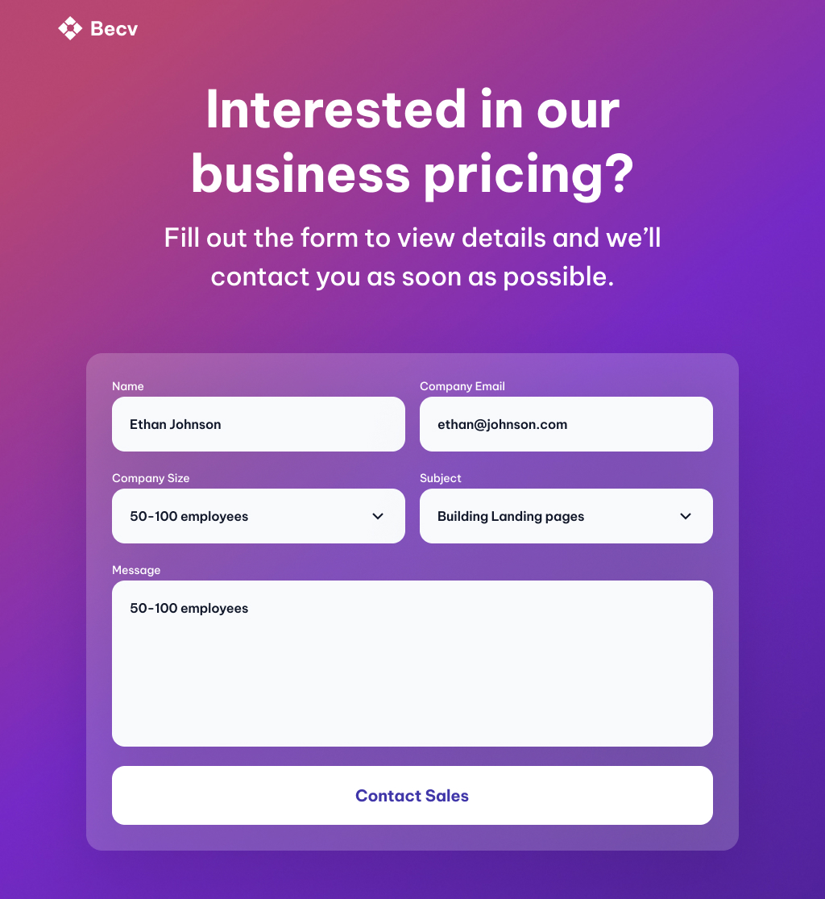
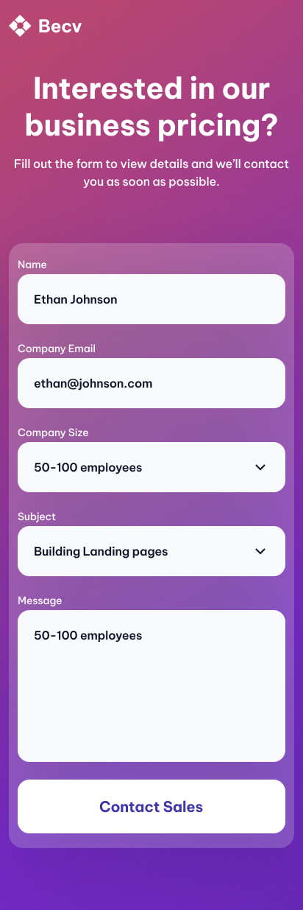

# Contact Page | devChallenges.io

  

---

## 📋 Overview

This project is a professional, pixel-perfect, and fully responsive contact page built for the devChallenges.io Contact Page challenge. The page is designed to closely match the provided design, with a focus on:

| Desktop | Tablet | Mobile |
| ------- | ------ | ------ |
|  |  |  |

- Modern, accessible HTML5 and CSS3 (no frameworks)
- Responsive layout for desktop, tablet, and mobile
- Custom color palette and box-shadow
- Form with input fields, dropdown, and styled button
- Clean, maintainable, and semantic code

---

## ✨ Features

- Fully responsive design for all screen sizes
- Custom select dropdown for company size
- Accessible and semantic HTML structure
- Modern UI with blur and shadow effects
- Button with smooth hover transition
- Uses provided assets and color palette

---

## 🛠️ Built With

- HTML5
- CSS3 (no frameworks)

---

## 🚀 Getting Started

1. Clone or download this repository.
2. Open `index.html` in your browser.
3. No build tools or dependencies required.

---

## 🧠 What I Learned

- Translating a Figma/JPG design into code
- Responsive layout techniques (flexbox, media queries)
- Customizing form elements and button styles
- Using box-shadow and backdrop-filter for modern UI
- Managing color palettes and accessibility

## 📚 Useful Resources

- [MDN Web Docs](https://developer.mozilla.org/) — HTML and CSS reference
- [CSS Tricks Flexbox Guide](https://css-tricks.com/snippets/css/a-guide-to-flexbox/) — Layout help
- [devChallenges.io Community](https://devchallenges.io/) — Challenge details and support
